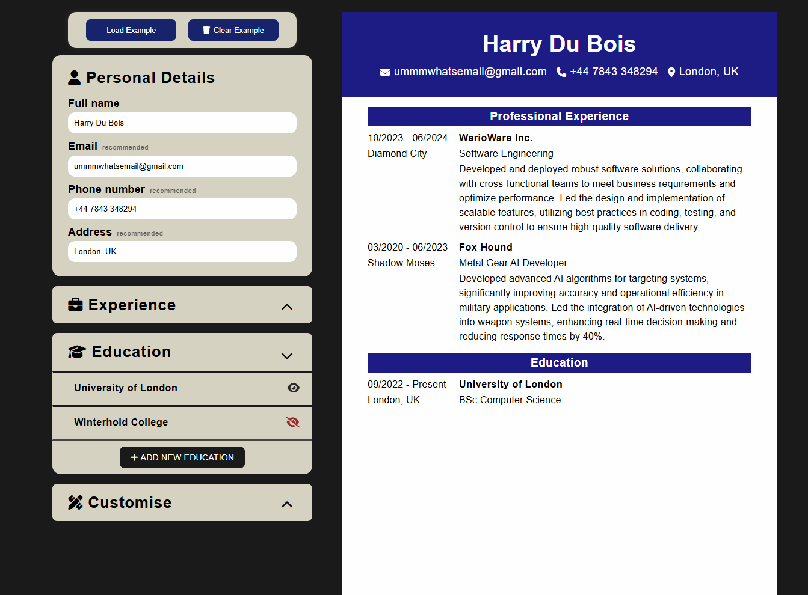

# 📄 CV Maker


**CV Maker** is a browser-based application that allows users to fill in a structured form and instantly generate a clean, professional CV. Built with React, it demonstrates practical form state management, real-time UI rendering and customisable CV output - no external CV libraries, just structured component logic.



## 📑 Table of Contents
- [The Vision](#-the-vision)
- [UI/UX](#-uiux)
- [Features](#-features)
- [Getting Started](#-getting-started)
- [Usage](#-usage)
- [Tech Stack](#️-tech-stack)
- [Architecture](#-architecture)
- [Development Principles](#-development-principles)
- [Future Improvements](#-future-improvements)

## 🎯 The Vision
CV builders are often over-engineered or locked behind paywalls. This project focuses on simplicity and practicality - a clean form that produces a ready-to-use CV, with enough customisation to make it feel personal.

- **Form-driven Output** - every field in the form maps directly to the CV layout, keeping the data flow predictable and easy to follow
- **Customisable** - users can adjust colours, fonts and layout to personalise their CV without overwhelming them with options
- **Zero dependencies** - no CV generation libraries, just React state and CSS styles

## 🎨 UI/UX
The interface keeps the focus on content, not the tool:
- **Split layout** - form panel on the left, live CV preview on the right
- **Typography** - clean sans-serif for the form, professional styling for the CV output
- **Colour palette** - minimal and neutral, keeping the focus on the CV content
- **Customisation panel** - adjust colours, fonts and layout without leaving the page

The result is an intuitive tool that gets out of the way and lets the content speak for itself.

## ✨ Features
- 📝 **Structured form** - fill in personal details, education and work experience
- 👁️ **Live CV preview** - CV updates in real time as the form is completed
- 🎨 **Customisation options** - adjust CV colours, fonts and layout
- 📂 **Collapsible sections** - expand and collapse form sections to reduce visual clutter
- ➕ **Add multiple entries** - add multiple education and experience entries dynamically
- 📋 **Example loader** - pre-fill the form with example data to preview the output instantly
- ⚛️ **State-driven rendering** - all form data managed through React hooks
- ⚡ **Fast & lightweight** - built with Vite for rapid development and optimised performance

## 🚀 Getting Started
### Prerequisites
- [Node.js](https://nodejs.org/) (v20.19 or v22.12 or higher)
- **npm** (included with Node.js)

### Installation & Setup
1. Clone the repository
```bash
git clone https://github.com/jpholdsworth/cv-maker.git
cd cv-maker
```

2. Install dependencies
```bash
npm install
```

3. Start the development server
```bash
npm run dev
```

4. Open your browser and visit `http://localhost:5173/`

## ⚡ Usage
1. Open the app in your browser
2. Fill in each section of the form - personal details, education and work experience
3. Add multiple education or experience entries using the **+** button
4. Use the customise panel to adjust CV colours, fonts and layout
5. Watch the CV preview update in real time on the right

## 🛠️ Tech Stack
- **React** - component-based UI and state management
- **CSS3** - layout, responsive design and print styles
- **Vite** - fast local development and production bundling

## 🧠 Architecture
The application separates form input, CV rendering and customisation. A single state in `App` drives both the form and preview.

| Component | Purpose |
| --- | --- |
| `App` | Global state and overall application flow |
| `DisplayForm` / `DisplayCV` | Form panel and live CV preview |
| `ExampleLoader` | Pre-fills the form with example CV data |
| `PersonalForm`, `EducationForm`, `ExperienceForm` | Section-specific form inputs |
| `FormInput`, `Buttons` | Reusable shared components |
| `CVSection`, `PersonalSection`, `EducationSection`, `ExperienceSection` | CV output rendering |
| `CustomiseSection` + children | Colour, font and layout customisation |
| `CollapsedForm`, `ExpandFormSection`, `AddNewForm` | Form UX - collapse, expand and add entries |

<details>
<summary>📁 File Structure</summary>

```
src/
├── components/
│   ├── customise/
│   ├── education/
│   ├── experience/
│   ├── personal/
│   └── *.jsx
├── styles/
│   ├── cv/
│   └── form/
├── example-data.js
├── App.jsx
└── main.jsx
```

</details>

## 🧩 Development Principles
- **Controlled components** - all inputs are controlled via React state for predictable behaviour
- **Single source of truth** - one state object in `App` drives both the form and the CV preview
- **Separation of concerns** - form logic, CV rendering, customisation and styling are clearly separated
- **Component reusability** - shared components like `FormInput`, `Buttons` and `CVSection` are used throughout
- **Performance-first** - no unnecessary dependencies, minimal bundle size

## 🔮 Future Improvements
- [ ] Improve responsive layout for mobile and tablet devices
- [ ] Add multiple CV templates to choose from
- [ ] Allow users to save and load CV data using `localStorage`
- [ ] Add PDF export functionality
- [ ] Support drag-and-drop section reordering

--- 

<div align="center">
    <strong>Made with ❤️ and ☕ by Jacob Holdsworth.</strong>
    <br><br>
    <a href="#-cv-maker">👆 Back to Top</a>
</div>